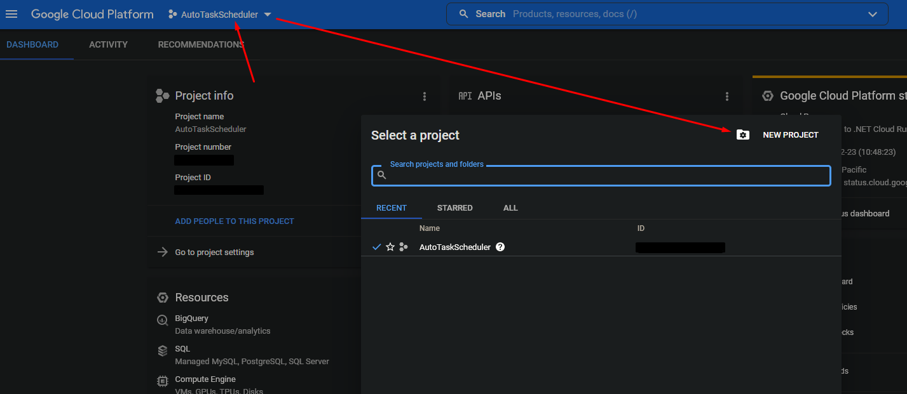
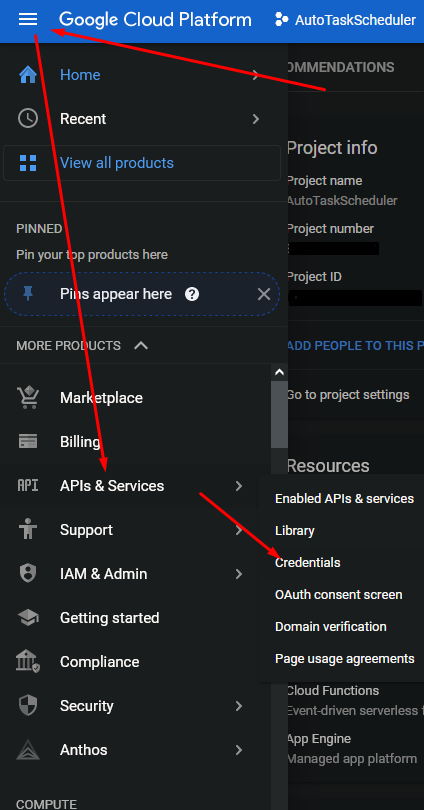

# Note
I noticed Google Tasks actually has a recurring option already. Somehow I didn't find that and instead just jumped into creating this little program. This program served as a nice practice for how to use the Google API. This is a nice base for adding on more features, like dynamic task scheduling. But as it stands now, it is pretty useless.

# AutoTaskScheduler

This is a program which can automatically add tasks to your Google Tasks according to a schedule. Right now it works by pre-defining a weekly schedule with on what day at what time what should be added to your tasks. The program is intended to be run on a Cron Job every ~30mins or so as it currently only executes a single iteration of checking the schedule and time. It does not automatically keep on running as of now.

## Setup
1. This little app is made with Node.js and therefore requires you to have `Node.js` and `npm` setup on your device. Check out this [page](https://docs.npmjs.com/cli/v7/configuring-npm/install) to find out more.
2. You additionally need a `credentials.json` file from Google. This is a bit more complicated to setup, so I'll go more in-depth down [below](#getting-that-credentialsjson-file).
2. Once you have the files in a folder, you should be able to run `npm install` to install all the required packages.
3. Then you can run `node .` or `node index.js` to start the main file. This will go through the setup process and link your Google Tasks account with this little app. You'll see a `token.json` file show up. If you're planning to use this app somewhere else without having to login again, this is the file you also need to copy over.
4. You can now run the program again (with `node .`) and you'll see a `taskLog.json` show up. This keeps track of all the created tasks. If you delete it, the app will recreate all the tasks of the *current* week.
5. Change around `schedule.json` to how you like. This is what determines when and how tasks are added.


## `schedule.json` format
This is how the schedule will look when you first pull it.
```json
{
    "dateFirstWeek": "2022-02-21",
    "taskListName": "MainList",
    "format": "${subject}: ${type}: Week ${week}",
    "schedule": [
        {
            "subject": "DMDB",
            "type": "Exercise",
            "weekday": "thursday",
            "time": 16
        }
    ]
}
```
`dateFirstWeek`: The Monday of the first week of the semester, so that the semester week can be calculated.

`taskListName`: The task list **exact** name to add the tasks to.

`format`: The format of what is written in the tasks:
- `subject`: This will be replaced with the subject name.
- `type`: This will be replaced with the type (Exercise/Lecture/etc.).
- `week`: This will be replaced with the amount of weeks since `dateFirstWeek`.

`schedule`: This determines when what is sent:
- `subject`: The name of the subject or event.
- `type`: The type of this event.
- `weekday`: The day of the week the task should be created. This **needs** to be a correctly spelled English week day. *Capitalization doesn't matter.*
- `time`: At what time the event should be added.


## Going even further
- I personally use [TasksBoard](https://tasksboard.com) to view my tasks in-browser and have the tasks page set as my home screen when I open my browser. This way I can always see what I have to do when I open my browser.
- On mobile I simply use the Google Tasks app and have it as a widget on my home screen. So it's hard to miss.

## Getting that `credentials.json` file
This is quite possibly the most tricky part of this whole app setup, as I don't have an automated way of having a user login without me having to share my own credentials file or hosting this app online somewhere.
1. Head over to https://console.cloud.google.com/ and login
2. Create a new project and name it whatever you want
3. Head to APIs & Services > Credentials
4. At the top you'll see a "Create Credentials" button. Create an `OAuth client ID` using that.
5. **IMPORTANT:** As the application type select `Desktop app`, name it whatever you want and then download the .json file.
6. Clap this .json file into the app folder and name it `credentials.json`.
7. And done! You should now be able to run the app successfully. If you get to a Google login screen, you should then get a code which you have to paste into the console. Upon successfully doing all that, a `token.json` file will be created.

### Maybe helpful images:



